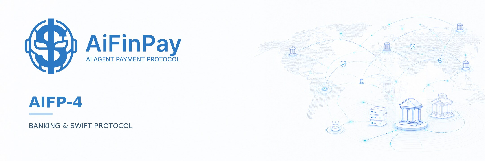
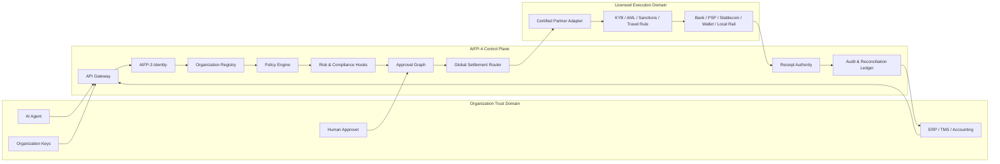
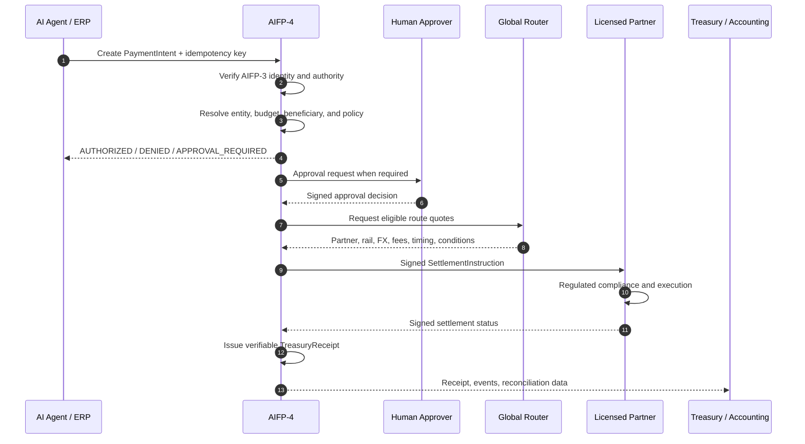
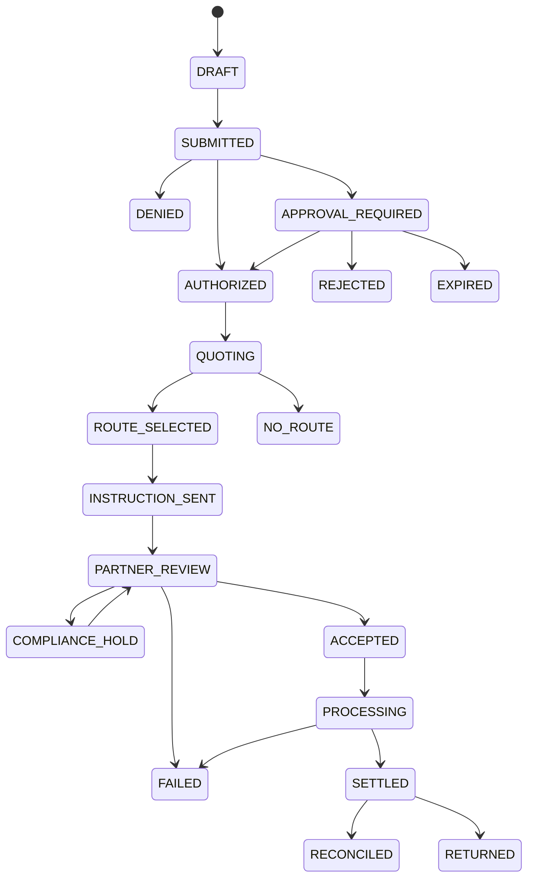
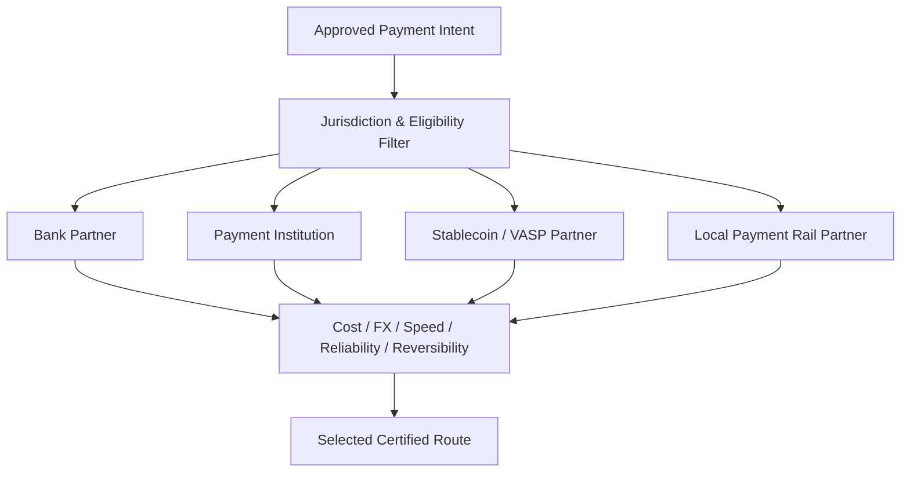

<p align="center">
  
</p>

<h1 align="center">AiFinPay AIFP-4 Banking &amp; SWIFT Protocol</h1>

<p align="center">
  <strong>Global financial messaging, policy enforcement, and settlement orchestration for AI agents and autonomous organizations.</strong>
</p>

<p align="center">
  A SWIFT-like coordination layer for the agent economy — built for corporate treasury, departments, subsidiaries, partners, suppliers, and cross-border organizations.
</p>

<p align="center">
  <a href="docs/index.md"></a>
  <a href="docs/aifp4/01-core-specification.md"></a>
  <a href="openapi/aifp-4.openapi.yaml"></a>
  <a href="SECURITY.md"></a>
  <a href="LICENSE"></a>
  <a href="https://github.com/AiFinPay/AIFP-4/actions"></a>
</p>

---

## One financial control plane for autonomous organizations

Companies are deploying AI agents across procurement, finance, operations, infrastructure, marketing, marketplaces, and partner networks. Those agents can make decisions, call tools, negotiate services, and trigger business processes — but corporate money movement is still fragmented across bank portals, spreadsheets, ERP approvals, payment providers, wallets, and manual controls.

**AIFP-4 gives organizations a standard way to let authorized software move money without giving autonomous agents unrestricted financial access.**

The protocol coordinates the complete decision path:

```text
Identity → Authority → Budget → Policy → Approval → Route → Licensed Execution → Receipt → Reconciliation
```

AiFinPay provides the protocol, authorization, policy, routing, and audit layer. Regulated settlement is executed by licensed partners in each jurisdiction.

> **Global protocol. Local licensing. Explicit authority. Verifiable execution.**

---

## What a company receives

| Capability | What it provides |
|---|---|
| **Organization Registry** | Models groups, legal entities, branches, departments, cost centers, projects, agents, accounts, wallets, partners, and beneficiaries. |
| **Agent Authority** | Uses AIFP-3 Agent Passport to bind every agent to an organization, role, mandate, limits, and signing identity. |
| **Policy Engine** | Enforces amount, budget, country, currency, beneficiary, purpose, asset, rail, timing, and velocity rules before money can move. |
| **Approval Graph** | Supports autonomous execution, one-person approval, M-of-N approval, sequential approval, CFO/CEO review, expiry, delegation, and emergency cancellation. |
| **Global Settlement Router** | Selects eligible banks, PSPs, stablecoin providers, wallets, local payment systems, and licensed corridor partners. |
| **Partner Network Model** | Lets local regulated providers execute settlement under country-specific partnership agreements and capability manifests. |
| **Treasury Receipts** | Produces cryptographically signed records binding intent, policy, approvals, route, fees, partner reference, and final status. |
| **Reconciliation Layer** | Matches internal instructions, partner statements, bank or blockchain evidence, ERP entries, and accounting records. |
| **Enterprise Integration** | Provides OpenAPI, JSON Schema, SDK types, events, webhooks, ERP/TMS integration patterns, and conformance rules. |
| **Security Controls** | Deny-by-default authorization, separation of duties, idempotency, replay protection, key rotation, freezes, allowlists, and tamper-evident logs. |

---

## Core use cases

### Internal corporate treasury

- Treasury allocates budgets to departments, projects, subsidiaries, or AI agents.
- Unused budgets can be recalled automatically.
- Agents can execute only within explicit purpose, amount, beneficiary, and time limits.
- High-value or unusual payments are routed to human approval.

### Autonomous procurement

- An AI procurement agent creates a payment intent linked to an invoice, contract, or purchase order.
- AIFP-4 checks supplier identity, duplicates, changed bank details, budget availability, and approval requirements.
- The selected licensed partner executes the payment.
- A signed treasury receipt is written back to ERP and accounting systems.

### Intercompany and cross-border movement

- Parent-to-subsidiary funding.
- Cross-border supplier and contractor payments.
- Intercompany settlement and treasury sweeps.
- Marketplace, royalty, partner, and revenue-share payouts.
- Route comparison by fee, FX, speed, jurisdiction, reliability, and reversibility.

### Agent-to-agent organizational settlement

- One authorized corporate agent requests settlement from another organization.
- Both organizations apply their own identity, policy, approval, and compliance rules.
- Execution occurs through an eligible partner corridor.
- Both sides receive verifiable records tied to the same financial intent.

---

## End-to-end architecture



### Trust boundary

AIFP-4 separates financial decisioning from regulated execution:

| AiFinPay / AIFP-4 | Licensed partner |
|---|---|
| Protocol and message standard | Regulated payment execution |
| Agent and organization authorization | KYC/KYB obligations assigned by contract |
| Corporate policy enforcement | AML, sanctions, and transaction monitoring assigned by contract |
| Approval workflows | Safeguarding, custody, FX, or transmission where licensed |
| Route discovery and selection | Local clearing, banking, card, stablecoin, or payout access |
| Signed receipts and audit evidence | Regulatory reporting, disputes, returns, and complaints where applicable |

A country or corridor becomes production-enabled only after legal review, contract execution, technical certification, security testing, and operational approval.

---

## How a payment moves



### State machine



Every transition is append-only, idempotent, attributable, and auditable.

---

## Policy-as-code

```yaml
organization_id: org_aifinpay
policy_version: 2026-07

scope:
  legal_entity_id: entity_estonia
  department_id: marketing

rules:
  allowed_purposes:
    - advertising
    - analytics
    - software

  allowed_currencies:
    - EUR
    - USD
    - USDC

  allowed_countries:
    - EE
    - UA
    - AE
    - US

  limits:
    per_transaction: "5000.00"
    daily: "15000.00"
    monthly: "100000.00"

  approvals:
    below_500: 0
    from_500_to_5000: 1
    above_5000: 2

  beneficiary_controls:
    require_known_beneficiary: true
    reverify_changed_bank_details: true
    new_beneficiary_cooling_period_seconds: 86400

  high_value_delay_seconds: 3600
```

An approval is cryptographically bound to the immutable payment-intent hash. Any material change to amount, currency, beneficiary, source entity, destination, or purpose creates a new intent and invalidates earlier approvals.

---

## Global licensed partner network

AIFP-4 is designed for worldwide coverage without pretending that one company license covers every jurisdiction.

Each certified partner publishes a signed capability manifest describing:

- legal entity and license references;
- permitted jurisdictions;
- source and destination countries;
- supported currencies and assets;
- available settlement rails;
- accepted customer and transaction types;
- minimum and maximum amounts;
- KYB, AML, sanctions, Travel Rule, and monitoring capabilities;
- data residency;
- operating limits and status.

The router selects a partner only when the transaction satisfies corporate policy, partner eligibility, jurisdiction requirements, operational health, and route constraints.



Read the full model in [Global Licensed Partner Network](docs/global-partner-network.md).

---

## Security model

AIFP-4 assumes agents, credentials, integrations, insiders, counterparties, and partners can fail or be compromised.

### Security baseline

- Zero-trust and deny-by-default authorization.
- Least privilege with role-based and attribute-based controls.
- Separation of policy administration, initiation, approval, and execution.
- AIFP-3 organization-bound identity and authority.
- Ed25519 signing profile with enterprise HSM/MPC options.
- Short-lived scoped credentials and independent key revocation.
- Nonce, expiry, canonical hashing, idempotency, and replay protection.
- Beneficiary, country, currency, purpose, asset, and rail allowlists.
- Velocity, concentration, anomaly, and high-value controls.
- New-beneficiary and changed-bank-details cooling periods.
- Signed partner capability manifests and callbacks.
- Organization, entity, department, agent, beneficiary, partner, route, currency, and asset freezes.
- Tamper-evident receipts and independent reconciliation.

### Threat controls

| Threat | Control |
|---|---|
| Prompt injection instructs an agent to pay an attacker | Tool isolation, known-beneficiary policy, purpose limits, approval threshold |
| Agent credential is stolen | Scoped short-lived credentials, velocity limits, revocation, freeze |
| Fake or duplicate invoice | Contract/PO matching, duplicate detection, beneficiary verification |
| Bank details are changed | Reverification, cooling period, out-of-band approval |
| API request is replayed | Nonce, expiry, idempotency key, immutable state checks |
| Insider changes policy and pays | Separation of duties, policy-change delay, independent approval |
| Partner sends a forged callback | Signature verification, sequence checks, rail-level reconciliation |

See [Security Model](docs/security-model.md) and [Security Policy](SECURITY.md).

---

## Verifiable treasury receipts

Every completed operation can produce a signed record containing:

```json
{
  "protocol_version": "0.1",
  "receipt_id": "rcp_01J...",
  "intent_id": "pi_01J...",
  "intent_hash": "sha256:...",
  "organization_id": "org_aifinpay",
  "source_entity_id": "ent_estonia",
  "initiating_identity_id": "agt_procurement_01",
  "policy_id": "pol_corporate_treasury",
  "policy_version": "2026-07",
  "approval_ids": ["apr_cfo_01"],
  "route_quote_id": "rte_01J...",
  "partner_id": "ptn_eu_01",
  "partner_reference": "settlement_ref_123",
  "final_status": "SETTLED",
  "issued_at": "2026-07-27T12:00:00Z",
  "key_id": "aifp4-receipt-key-2026-07",
  "signature": "base64url-ed25519-signature"
}
```

The receipt is designed to be independently verifiable without trusting mutable dashboard data.

---

## Developer surface

The repository contains:

| Surface | Location |
|---|---|
| Protocol portal | [`docs/index.md`](docs/index.md) |
| Core normative specification | [`docs/aifp4/01-core-specification.md`](docs/aifp4/01-core-specification.md) |
| Architecture | [`docs/architecture.md`](docs/architecture.md) |
| Security model | [`docs/security-model.md`](docs/security-model.md) |
| Compliance boundaries | [`docs/compliance-boundaries.md`](docs/compliance-boundaries.md) |
| Partner-network specification | [`docs/global-partner-network.md`](docs/global-partner-network.md) |
| Transaction lifecycle | [`docs/message-lifecycle.md`](docs/message-lifecycle.md) |
| OpenAPI 3.1 | [`openapi/aifp-4.openapi.yaml`](openapi/aifp-4.openapi.yaml) |
| JSON Schemas | [`schemas/`](schemas/) |
| TypeScript reference core | [`src/`](src/) |
| Reference workflows | [`examples/`](examples/) |
| Roadmap | [`ROADMAP.md`](ROADMAP.md) |
| Governance | [`GOVERNANCE.md`](GOVERNANCE.md) |

### Reference package

```bash
npm install
npm run typecheck
npm test
npm run build
```

The package exports:

```ts
export * from "./types.js";
export * from "./canonical.js";
export * from "./policy-engine.js";
export * from "./state-machine.js";
export * from "./receipt.js";
export * from "./orchestrator.js";
```

> The current package is a reference implementation for protocol development and evaluation. It is not a production bank connector or licensed settlement service.

---

## Protocol family

| Protocol | Role |
|---|---|
| **AIFP-1** | Monetization of AI traffic and paid access to websites, APIs, data, compute, and digital services. |
| **AIFP-2** | Agent payment execution and x402-style payment flows. |
| **AIFP-3** | Agent Passport: identity, organization binding, authority, permissions, and trust. |
| **AIFP-4** | Corporate treasury, internal allocation, intercompany movement, global routing, and inter-organization settlement orchestration. |

A complete AiFinPay workflow can use AIFP-3 to identify and authorize an agent, AIFP-4 to approve and route the corporate spend, AIFP-2 to execute an eligible payment, and AIFP-1 to unlock the paid resource.

---

## Commercial model

AIFP-4 supports negotiated enterprise pricing and volume-based tiers.

| Tier | Typical profile | Indicative framework |
|---|---|---:|
| **Tier 1** | Strategic networks, global enterprises, licensed partners | Approximately 0.3%–0.5%, basis-point pricing, flat fees, caps, or custom agreement |
| **Tier 2** | Growth companies, multi-entity groups, agent fleets | Approximately 0.5%–0.8% |
| **Tier 3** | Standard organizations and builders | Approximately 0.8%–1.0% |

Large treasury transfers should use negotiated basis-point pricing, minimums, caps, flat instruction fees, platform licensing, or committed-volume terms. Bank, PSP, FX, blockchain, compliance, liquidity, and local partner charges are separate and must be disclosed in the route quote.

See [Protocol Economics](docs/economics.md).

---

## Licensing and intellectual-property protection

AIFP-4 uses separate protection layers because one license cannot simultaneously create an open integration standard and prohibit every form of copying.

| Layer | Rights |
|---|---|
| **Public specification** | Available for reading, evaluation, interoperability work, and independent compatible implementations under the applicable documentation terms. |
| **Reference implementation** | Source-available under the terms in [`LICENSE`](LICENSE); commercial production use requires permission where stated. |
| **Commercial use** | Managed services, production embedding, white-labeling, resale, partner-network access, enterprise modules, and commercial deployment require a written agreement. |
| **Trademarks** | AiFinPay, AIFP, AIFP-1, AIFP-2, AIFP-3, AIFP-4, network names, logos, badges, and certification marks remain protected. |
| **Patents** | Potential patent rights and reserved technical inventions are described separately. |

Read before using the project:

- [`LICENSE`](LICENSE) — repository licensing structure.
- [`COMMERCIAL-LICENSE.md`](COMMERCIAL-LICENSE.md) — activities requiring a commercial agreement.
- [`TRADEMARKS.md`](TRADEMARKS.md) — brand and certification restrictions.
- [`PATENTS.md`](PATENTS.md) — patent reservation and contribution notice.

**Publishing the specification does not grant permission to present a fork as official AIFP-4, use AiFinPay branding, claim certification, access private partner infrastructure, or commercially deploy source-available code outside its license.**

---

## Current status

| Area | Status |
|---|---|
| Protocol positioning and architecture | Available |
| Core specification v0.1 | Draft |
| OpenAPI 3.1 | Draft |
| Initial JSON Schemas | Available |
| TypeScript reference core | Available for evaluation |
| Policy engine and state machine | Reference implementation |
| Receipt signing and verification | Reference implementation |
| Production database and multi-tenant control plane | Planned |
| AIFP-3 production integration | Planned |
| HSM/MPC production key management | Planned |
| Bank, PSP, stablecoin, and local-rail adapters | Requires contracted partners |
| Live international corridors | Not active until partner, legal, security, and operational approval |
| External security and compliance certification | Required before production claims |

AIFP-4 is currently a **draft protocol and executable reference foundation**. It must not be described as a live worldwide payment network until real licensed partners, production systems, audits, certifications, monitoring, reconciliation, and supported corridors are active.

---

## Build with AIFP-4

### For enterprises

Use AIFP-4 to define how agents, departments, subsidiaries, and partners can request, approve, route, execute, and reconcile corporate payments.

### For banks and payment providers

Connect as a licensed execution partner, publish supported capabilities, receive policy-approved settlement instructions, and expose signed status events.

### For ERP and treasury platforms

Integrate payment intents, approvals, receipts, reconciliation events, and policy data into existing corporate systems.

### For AI-agent developers

Give agents explicit financial mandates instead of unrestricted wallets, shared API keys, or human-owned card credentials.

Commercial, partner, certification, and enterprise rights are available only through a written AiFinPay agreement.

---

## Legal boundary

AIFP-4 is a technical protocol and orchestration architecture. It does not itself grant financial permissions, replace legal advice, create a global license, or authorize an unlicensed entity to provide regulated financial services.

Production implementations must use appropriately licensed providers and satisfy applicable rules in every relevant jurisdiction. Responsibilities for onboarding, KYC/KYB, AML, sanctions, Travel Rule, custody, safeguarding, FX, execution, reporting, disputes, returns, and data protection must be allocated in written contracts.

See [Compliance and Regulatory Boundaries](docs/compliance-boundaries.md).

---

<p align="center">
  <strong>AiFinPay is building financial infrastructure for the agent economy.</strong>
</p>

<p align="center">
  <a href="https://aifinpay.io">Website</a> ·
  <a href="https://github.com/AiFinPay">GitHub</a> ·
  <a href="https://www.linkedin.com/company/aifinpay">LinkedIn</a> ·
  <a href="docs/index.md">Documentation</a>
</p>
